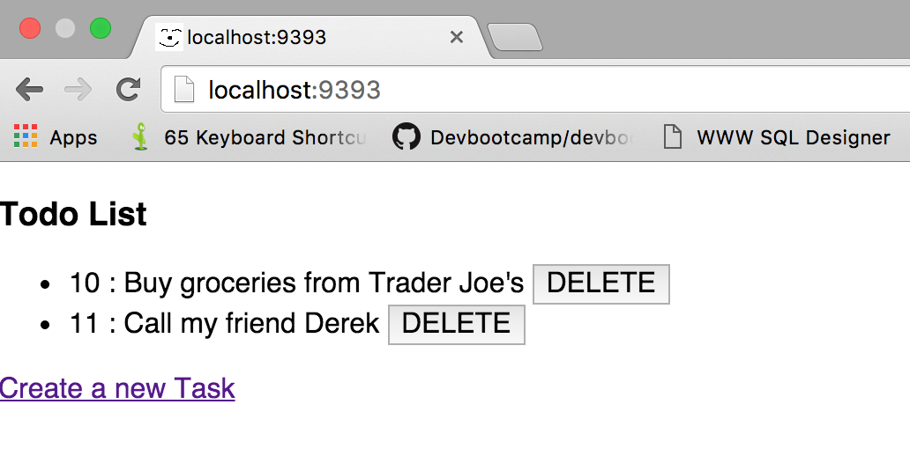
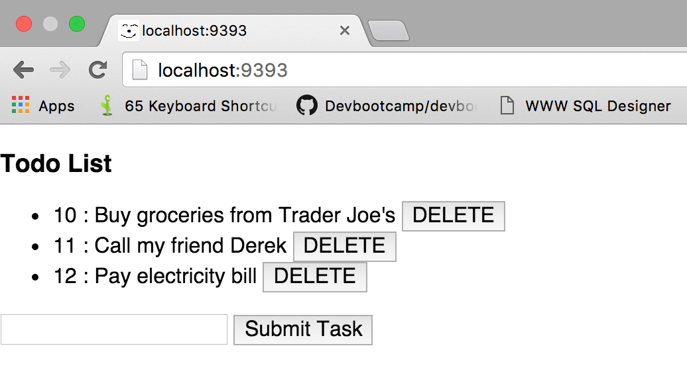

### AJAX Todo List Challenge

In this challenge, using the Sinatra Skeleton, you will be building a simple TODO list application with Create, Read and Delete functionality and AJAX-ifying a working Sinatra app.

#### Release 0

To get started, go ahead and clone the sinatra skeletion. Build necessary migrations, models and seed files required for your TODO list application. Next, install your dependencies and create, migrate and seed your database.

#### Release 1

User when visits the root page( / ) should see the following web page (with atleast two tasks each having a DELETE button and a link to create a new task).

#### Release 2

1. Clicking on the link [Create a new Task] should render the form to create a new task and remove/hide the link as shown below.  AJAX the rendering of the form that's used to create a new task so that it is dynamically loaded. 

#### Release 3

1. Upon submission of this form that was dynamically added, we want to append the new task to the existing list of tasks, like so using AJAX:

#### Release 4

Lastly, make the delete button functional. Clicking the DELETE button should delete the associated task from the database and consequently remote the task from the DOM using AJAX. 

#### Release 5

Done? Refactor your JavaScript to make it more organized. Also, double check your controller methods to make sure they are as organized as possible and control for if a method is evaluated from an AJAX call or a normal HTTP request.
